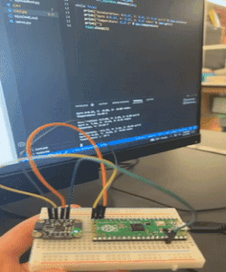
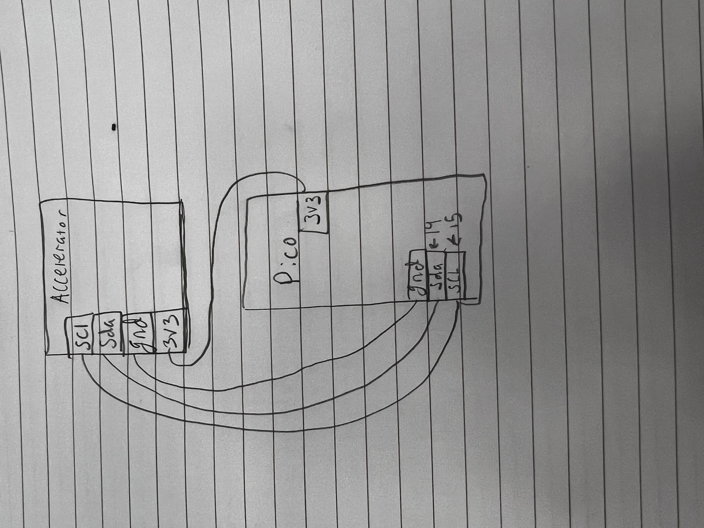
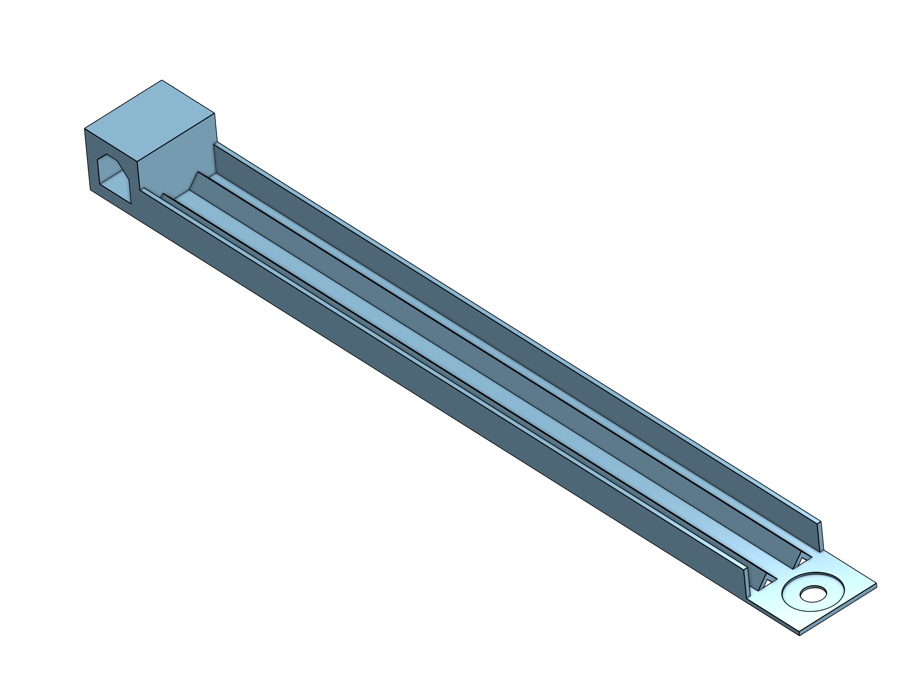
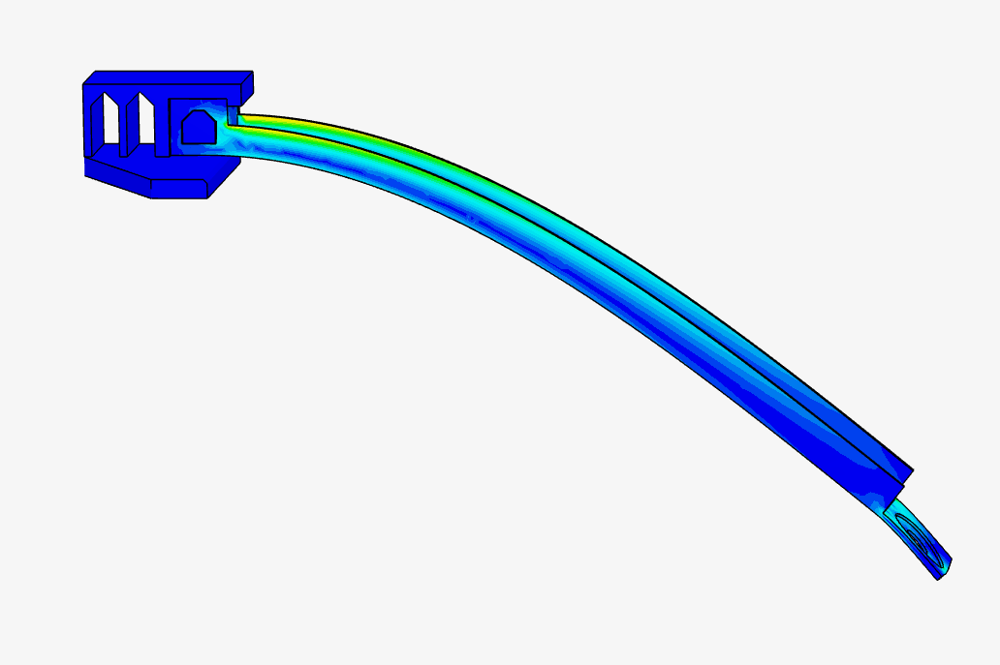
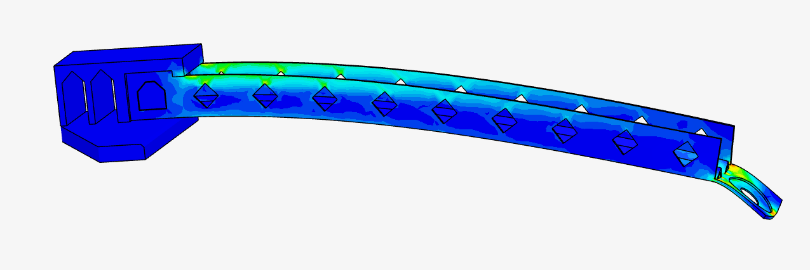
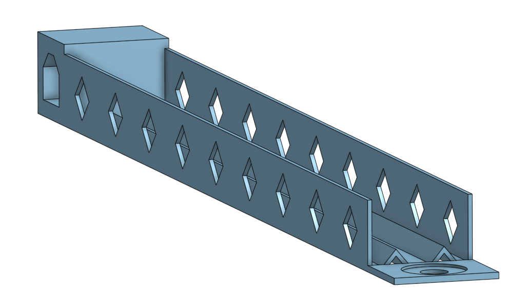
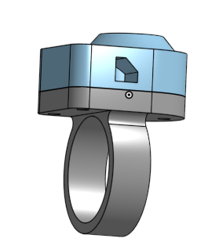
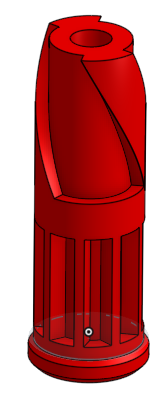
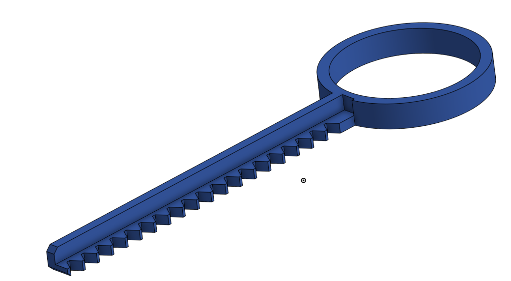

# Engineering_4_Notebook Ellen+Gaby


## Table of Contents
* [Pico Intro](#Pico_Intro)
* [Launchpad 1-Countdown](#Launchpad_1-Countdown)
* [Launchpad 2-LED](#Launchpad_2-LED)
* [Launchpad 3-Button](#Launchpad_3-Button)
* [Launchpad 4-Servo](#Launchpad_4-Servo)
* [Crash Avoidance P1](#Crash_Avoidance_P1)
* [Crash Avoidance P2](#Crash_Avoidance_P2)
* [Crash Avoidance P3](#Crash_Avoidance_P3)
* [Landing Area P1](#Landing_Area_P1)
* [Landing Area P2](#Landing_Area_P2)
* [Morse Code P1](#Morse_Code_P1)
* [Morse Code P2](#Morse_Code_P2)
* [FEA_Part1](#FEA_Part1)
* [FEA_Part2](#FEA_Part2)
* [FEA_Part3](#FEA_Part3)
* [CAD_Ring](#CAD_Ring)
* [CAD Spinner](#CAD_Spinner)
* [CAD Key](#CAD_Key)

## Pico_Intro

### Assignment Description

I had to get my pico to blink it's led. 

### Evidence 


### Code

``` python
import time
import board #import stuff
import digitalio

led = digitalio.DigitalInOut(board.LED)
led.direction = digitalio.Direction.OUTPUT  #led setup

while True:
    led.value = True  #led on
    time.sleep(0.5)  #led rest
    led.value = False  #led off
    time.sleep(0.5)  #led off

```

### Reflection

First you have to import your stuff, then you set up the power flowing to the led. Using a while True, you turn the led on and then make it rest .5 seconds. Then you turn it off and have it rest again so it has been reset for the next usage. 

## Launchpad_1-Countdown

### Assignment Description

I worked with Gaby to code a 10 second countdown on Python that tells you to launch when the count ends. This will be useful for our final project. 

### Evidence 


### Code

``` python
import time
for x in range (10,0,-1):  #counting range for timer
    print(x)
    time.sleep (1)  #rest 1 sec between each number
print("LAUNCHY")   #say dis

```

### Reflection

This was a relatively simple assignment, we learned how to use range through [this](https://www.w3schools.com/python/gloss_python_for_range.asp) which makes the countdown work. The time.sleep makes it so there is space between the countdown of numbers. The code works together by providing the range of available numbers and then telling it to coundown slowly for legibility before printing LAUNCH. 

## Launchpad_2-LED

### Assignment Description

Today Gaby and I created code to make a red light flash as the serial monitor counts down from ten and then flashes a red light when the word 'launch' is printed. This will be useful later in the year if we need LEDs for our project or something that functions similarly either through code or practice. 


### Evidence


### Wiring


### Code

``` python

import time #Imports variables
import board
import digitalio 

led1 = digitalio.DigitalInOut(board.GP13) #where the stuff is at
led1.direction = digitalio.Direction.OUTPUT #gives direcction
led2 = digitalio.DigitalInOut(board.GP18) 
led2.direction = digitalio.Direction.OUTPUT 

for x in reversed(range(11)): 
    led1.value = True #turns light on
    time.sleep(0.5) #wait time
    print(x) #tells it what to say
    led1.value = False #turns led off
    time.sleep(0.5) 
while True:
    print("liftoff!") #what to say
    led2.value = True #turns red light on
    time.sleep(0.5) #hits snooze
 
 ```

### Reflection

I had trouble figuring out the positioning of the code because one led has to be later on becasue it depends on the countdown being finished vs happening at the same time. Originally our red led was not working and we thought it was the code, but the problem was actually that we had misidentified our leds.Proving the idea that it's important to label things because it makes things more organized and easier to use or understand later on. 

## Launchpad_3-Button

### Assignment Description

Today Gaby and I created code so that our countdown and leds will start at the press of a button. (To mimic a more realistic countdown sequence)


### Evidence


### Wiring


### Code

``` python

import time #imports
import board
import digitalio

led1 = digitalio.DigitalInOut(board.GP13) #pins 
led1.direction = digitalio.Direction.OUTPUT
led2 = digitalio.DigitalInOut(board.GP18)
led2.direction = digitalio.Direction.OUTPUT
button = digitalio.DigitalInOut(board.GP16) #adds in the button
button.direction = digitalio.Direction.INPUT
button.pull = digitalio.Pull.UP #incorperates the button into the circuit

while True: #if the button is pressed this will happen
     if button.value == False:
          for x in reversed(range(11)):
               led1.value = True #light bright
               time.sleep(0.5) #light snooze
               print(x)
               led1.value = False #light off
               time.sleep(0.5)
          while True:
               print("liftoff!") #says dis
               led2.value = True
               time.sleep(0.5)
 
 ```

### Reflection

Alright, so as someone with very limited experience and liking for coding, this took a lot of questions and thinking. I was still just adding on to my previous code, but I have never used a button, much less coded for it so that was new. First off, I didn't know where to put the new code (again). I had to add "if button.value == False:" and then tab everything over a bunch under it. This makes it so that once you press the button everything else follows. 


## Launchpad_4-Servo

### Assignment Description

Today Gaby and I had to add on to our countdown code again so that a servo will turn 180 degrees at the end of the ciruit and mimic the liftoff. 

### Evidence


### Wiring


### Code

``` python
import time    #importing stuff
import board
import digitalio
import pwmio 
from adafruit_motor import servo

led1 = digitalio.DigitalInOut(board.GP13)
led1.direction = digitalio.Direction.OUTPUT
led2 = digitalio.DigitalInOut(board.GP18)
led2.direction = digitalio.Direction.OUTPUT
button = digitalio.DigitalInOut(board.GP16)  #what stuff is going in vs out and where it's at
button.direction = digitalio.Direction.INPUT
button.pull = digitalio.Pull.UP
pwm_servo = pwmio.PWMOut(board.GP5, duty_cycle=2 ** 15, frequency=50)  #setting up servo
servo1 = servo.Servo(pwm_servo, min_pulse=500, max_pulse=2500)

servo1.angle = 0


while True: 
     if button.value == False:    #so when we aren't pressing it anymore
          for x in reversed(range(11)):
               led1.value = True
               time.sleep(0.5)     #rest a sec between counts
               print(x)
               led1.value = False
               time.sleep(0.5)
          while True:
               print("liftoff!")     #say liftoff
               led2.value = True
               servo1.angle = 180     #turn180
               time.sleep(0.5)
              
```

### Reflection

We decided to set the servo angle to 0 so that our servo would start from the same place each time because we realized after running the code a couple times, the servo would be in the wrong starting position and not work as well.  We were in the wrong pin because Gaby thought that the 7th pin down was GP7, but it was actually GP5 so once we had that figured out the servo worked and we were done. Using button.value == False, I was able to set up the code so that the while true would run once I finished pressing the button. 

## Crash_Avoidance_P1

### Assignment Description

I had to get an accelerometer working and print acceleration, gyro, and temperature values in the terminal. 

### Evidence 



### Wiring 



### Code

``` python
import time #imports stuff
import board
import adafruit_mpu6050
import busio

sda_pin = board.GP14  #sets up i2c
scl_pin = board.GP15
i2c = busio.I2C(scl_pin, sda_pin)  #sets up accelerometer
mpu = adafruit_mpu6050.MPU6050(i2c)

while True:
    print("Acceleration: X:%.2f, Y: %.2f, Z: %.2f m/s^2" % (mpu.acceleration))
    print("Gyro X:%.2f, Y: %.2f, Z: %.2f rad/s" % (mpu.gyro))  #things serial monitor needs to read
    print("Temperature: %.2f C" % mpu.temperature)
    print("")
    time.sleep(1)
```

### Reflection

After downloading the necessary folder modules needed for this code, it goes pretty smoothly. You need to have Acceleration, temperature, and gyro in order to find all the values for the assignment. Don't be alarmed by the ~9.8 because that's just gravity and is not going to mess with your values or anything. 


## Crash_Avoidance_P2

### Assignment Description

I had to get an accelerometer working so that when it was 90 degrees an led would turn on.  

### Evidence 


### Wiring 


### Code

``` python
import board  #import stuff
import adafruit_mpu6050
import busio 
import time
import digitalio 

led_1 = digitalio.DigitalInOut(board.GP18)   #led setup
led_1.direction = digitalio.Direction.OUTPUT
sda_pin = board.GP14   #setup pico
scl_pin = board.GP15
i2c = busio.I2C(scl_pin, sda_pin)
mpu = adafruit_mpu6050.MPU6050(i2c)


while True:
    print(mpu.acceleration)   #say the values
    time.sleep(.5)

    if mpu.acceleration[0] < -9 or mpu.acceleration[0] > 9:
        led_1.value = True  #at 90 degrees led is on

    else:
        led_1.value = False  #if not led is off
```

### Reflection

This assignment was actually very easy. After importing everything you setup your led and wiring (double check that you are in the correct pins, i2c are still 2 pins off). The only thing you have to make sure you do is have the correct angle and degrees for the mpu.acceleration, we want it at 90 so when it's vertical the light will come on.

## Crash_Avoidance_P3

### Assignment Description

I had to get my led to blink at 90 degrees and print gyro xyz values onto a screen as well. 

### Evidence 


### Wiring 


### Code

``` python
import board  #import shit
import adafruit_mpu6050
import busio 
import time
import digitalio 
import terminalio
import displayio
from adafruit_display_text import label
import adafruit_displayio_ssd1306

displayio.release_displays()
sda_pin = board.GP14   #setup pico
scl_pin = board.GP15
i2c = busio.I2C(scl_pin, sda_pin)
display_bus = displayio.I2CDisplay(i2c, device_address=0x3d, reset=board.GP28)
display = adafruit_displayio_ssd1306.SSD1306(display_bus, width=128, height=64)
led_red = digitalio.DigitalInOut(board.GP18)   #led setup
led_red.direction = digitalio.Direction.OUTPUT

mpu = adafruit_mpu6050.MPU6050(i2c, address=0x68) #accelerometer


while True:
    print(mpu.acceleration)   #say the values
    time.sleep(.5)
    print("Gyro X:%.2f, Y: %.2f, Z: %.2f rad/s" % (mpu.gyro))
    splash = displayio.Group()  #create the display group

    title = "ANGULAR VELOCITY" #add title block to display group
    text_area = label.Label(terminalio.FONT, text=title, color=0xFFFF00, x=5, y=5)
    splash.append(text_area) 

    title = f"x: {mpu.gyro[0]}" 
    text_area = label.Label(terminalio.FONT, text=title, color=0xFFFF00, x=5, y=15) # determines and prints x value
    splash.append(text_area)  
    
    title = f"y: {mpu.gyro[0]}" 
    text_area = label.Label(terminalio.FONT, text=title, color=0xFFFF00, x=5, y=30) # figures and and says y value
    splash.append(text_area) 

    title = f"z: {mpu.gyro[0]}" 
    text_area = label.Label(terminalio.FONT, text=title, color=0xFFFF00, x=5, y=45) # same thing with z
    splash.append(text_area)


    display.show(splash) #send display group to screen
    if mpu.acceleration[0] < -9 or mpu.acceleration[0] > 9:
        led_red.value = True  #at 90 degrees led is on

    else:
        led_red.value = False  #if not led is off

```

### Reflection

I forgot to use the code to find the addresses of the devices so that tripped me up for a while. To find the addresses, run [this code](https://drive.google.com/file/d/1YEmYYJnxZW2rdZCV6Mmu-fHIeQoKGVfL/view) and be sure to check which address is for each device. Also be sure to check your wiring because i2c wiring is always off 2 pins. 


## Landing_Area_P1

### Assignment Description

I had to get my serial monitor to take my chosen coordinates of a triangl and tell me the area.  

### Evidence 


### Code

``` python
import math
def tri_area(x1, y1, x2, y2, x3, y3):
    niceAreaValue = (abs(x1*(y2-y3)+x2*(y3-y1)+x3*(y1-y2)))/2   # the math is mathing
    print(f"The area of the triangle with vertices ({x1}, {y1}), ({x2}, {y2}), ({x3}, {y3}) is {niceAreaValue}")  # print coordinates so you can fill it out
while True:
    try:
        txt1 = input("Input coord set 1 (x,y)") # input coordinates
        set1 = txt1.split(",")

        a1 = float(set1[0])
        b1 = float(set1[1])

        txt2 = input("Input coord set 2 (x,y)")  # input coordinates
        set2 = txt2.split(",")

        a2 = float(set2[0])
        b2 = float(set2[1])

        txt3 = input("Input coord set 3 (x,y)") # input coordinates
        set3 = txt3.split(",")

        a3 = float(set3[0])
        b3 = float(set3[1])

        tri_area(a1, b1, a2, b2, a3, b3)

except:
        print("Please input valid coordinates (remember format x,y)")  # if u suck, it lets you know

```

### Reflection

Using Try, you can input different coordinates and it allows you to try them, however you can use except with it so that when incorrect coordinates are used it stops the code and tells you to retry. This is convenient and fairly simple to use which makes it something you can use in mnay different code setups. The area formulas take your given coordinates and do the math of getting the triangle area for you, saving you time and braincells. 


## Landing_Area_P2

### Assignment Description

I had to get my serial monitor to take my chosen coordinates of a triangl and tell me the area and then graph it on the oled screen. 

### Evidence 


### Wiring 


### Code

``` python
import math
import board
from adafruit_display_shapes.triangle import Triangle
from adafruit_display_shapes.line import Line
from adafruit_display_shapes.circle import Circle  #import shiz
import displayio
import adafruit_displayio_ssd1306
import busio

displayio.release_displays()
sda_pin = board.GP14
scl_pin = board.GP15
i2c = busio.I2C(scl_pin, sda_pin)  # setting stuff up

display_bus = displayio.I2CDisplay(i2c, device_address=0x3d, reset=board.GP19)
display = adafruit_displayio_ssd1306.SSD1306(display_bus, width=128, height=64) # screen setup


def tri_area(x1, y1, x2, y2, x3, y3):
    niceAreaValue = (abs(x1*(y2-y3)+x2*(y3-y1)+x3*(y1-y2)))/2  #these are my triangle coordinates
    print(f"The area of the triangle with vertices ({x1}, {y1}), ({x2}, {y2}), ({x3}, {y3}) is {niceAreaValue}")  # Area with vertices
while True:
    try:
        txt1 = input("Input coord set 1 (x,y)")  #COORDINATES
        set1 = txt1.split(",")

        a1 = float(set1[0])
        b1 = float(set1[1])

        txt2 = input("Input coord set 2 (x,y)")
        set2 = txt2.split(",")

        a2 = float(set2[0])
        b2 = float(set2[1])

        txt3 = input("Input coord set 3 (x,y)")
        set3 = txt3.split(",")

        a3 = float(set3[0])
        b3 = float(set3[1])

        tri_area(a1, b1, a2, b2, a3, b3)  #area

        c1 = int(a1)
        d1 = int(b1)

        c2 = int(a2)
        d2 = int(b2)

        c3 = int(a3)
        d3 = int(b3)

        splash = displayio.Group()

        hline = Line(0, 32, 128, 32, color=0xFFFF00)
        splash.append(hline)

        hline = Line(64, 64, 64, 0, color=0xFFFF00)
        splash.append(hline)

        circle = Circle(64, 32, 6, outline=0xFFFF00)  #sets up size too
        splash.append(circle)


        triangle = Triangle(c1, d1, c2, d2, c3, d3, outline=0xFFFF00)  #area mATHING
        splash.append(triangle)
        display.show(splash)
    except:
        print("Please input valid coordinates (remember format x,y)") #u suck, fix it
```

### Reflection

Our biggest issue was not being able to see our triangle on the screen because our screen's x and y scale was different then expected. Once we adjusted to fit the screen, our coordinates made a nice triangl that was clearly visible on the screen. We adjusted the location of the triangles by adding numbers to the hline which moved the trianlges into visible quadrants of the screen. 


## Morse_Code_P1

### Assignment Description

I had to write code so that whatever message you type in is then translated into morse code. 

### Evidence 


### Code

``` python

MORSE_CODE = { 'A':'.-', 'B':'-...',  #dictionary
    'C':'-.-.', 'D':'-..', 'E':'.',
    'F':'..-.', 'G':'--.', 'H':'....',
    'I':'..', 'J':'.---', 'K':'-.-',
    'L':'.-..', 'M':'--', 'N':'-.',
    'O':'---', 'P':'.--.', 'Q':'--.-',
    'R':'.-.', 'S':'...', 'T':'-',
    'U':'..-', 'V':'...-', 'W':'.--',
    'X':'-..-', 'Y':'-.--', 'Z':'--..',
    '1':'.----', '2':'..---', '3':'...--',
    '4':'....-', '5':'.....', '6':'-....',
    '7':'--...', '8':'---..', '9':'----.',
    '0':'-----', ',':'--..--', '.':'.-.-.-',
    '?':'..--..', '/':'-..-.', '-':'-....-',
    '(':'-.--.', ')':'-.--.-'}


mouse1 = input("Mouse code set 1 (x,y)")  #input
mouse1 = mouse1.upper() #make things uppercase

cheese = " " #total strings

for letter in mouse1: # use MORSE_CODE[letter] here to translate from input into morse code
   cheese = cheese + (MORSE_CODE[letter]) + " " #stacks letters

print(cheese) #write it

```

### Reflection

My variables may seem confusing at first, but essentially Cheese is the strings (string cheese) and connects them so that everything is more smoothly connected. Mouse is the alphabet and how the code works together. Using a dictionary is convenient because it allows you to use many variables and in this case, it allows you to use any letter of the alphabet and number/character to express a message. 


## Morse_Code_P2

### Assignment Description

I had to write code so that when you type a mesage into the terminal, it's translated into morse code and then an LED blinks to spell out the message. 

### Evidence 


### Wiring 


### Code

``` python
import board
import digitalio
import time #imports

MORSE_CODE = { 'A':'.-', 'B':'-...',  #dictionary, goes on top
    'C':'-.-.', 'D':'-..', 'E':'.',
    'F':'..-.', 'G':'--.', 'H':'....',
    'I':'..', 'J':'.---', 'K':'-.-',
    'L':'.-..', 'M':'--', 'N':'-.',
    'O':'---', 'P':'.--.', 'Q':'--.-',
    'R':'.-.', 'S':'...', 'T':'-',
    'U':'..-', 'V':'...-', 'W':'.--',
    'X':'-..-', 'Y':'-.--', 'Z':'--..',
    '1':'.----', '2':'..---', '3':'...--',
    '4':'....-', '5':'.....', '6':'-....',
    '7':'--...', '8':'---..', '9':'----.',
    '0':'-----', ',':'--..--', '.':'.-.-.-',
    '?':'..--..', '/':'-..-.', '-':'-....-',
    ' ': '/',
    '(':'-.--.', ')':'-.--.-'}

modifier = 0.25
dot_time = 1*modifier
dash_time = 3*modifier  #timing of flashes
between_taps = 1*modifier
between_letters = 3*modifier
between_words = 7*modifier

led1 = digitalio.DigitalInOut(board.GP13)
led1.direction = digitalio.Direction.OUTPUT #led setup

mouse1 = input("Mouse code set 1 (x,y)")  #input
mouse1 = mouse1.upper() #make things uppercase

cheese = " " #total strings

for letter in mouse1: # use MORSE_CODE[letter] here to translate from input into morse code
   cheese = cheese + (MORSE_CODE[letter]) + " " #stacks letters

print(cheese) #write it

for letter in cheese: #sets up spaces bwteen instances
    if letter == ".": #for dots
        led1.value = True #led turns on
        time.sleep(dot_time) #sleeps for the set time for dots
        led1.value = False #led is off

    if letter == "-": #now for dashes
        led1.value = True #led on
        time.sleep(dash_time) #dash sleep time
        led1.value = False #led off

    if letter == " ": #for spaces
        time.sleep(between_letters)  #rest for set space time between letters

    if letter == "/":  #for spaces between words which show as dashes
        time.sleep(between_words) #rest between words for set time

    
    time.sleep(dot_time) #stop led between uses of the code
    
```

### Reflection
This assignment justs builds off of all the previous ones which means you can figure a lot of things out on your own and fix your mistakes as you move through it.After adding Mr. Miller's code for the spacing between characters, I added an led using code from servo.py further up in my notebook. In order to actually use the code for the spacing, I used if statements to turn the led on and off and set the spacing.  


## FEA_Part1

### Assignment Description

We had to design a beam that would hold as much weight as possible without breaking or bending more than 35mm. We hope to learn more about the functions and tools on Onshape.

### Evidence 



### Reflection

We went for a simple design at first that we thought would be more stable than a complex one. We had walls and had 2 triangular rows going through the center of the beam, to increase flexibility so the beam wouldn't snap. The weight was within criteria but the end of our beam seemed thin to support a bucket and excess weight, we addressed that problem after using the sim in the next part of the assignment. 


## FEA_Part2

### Assignment Description

We had to run one static finite element analysis sim on our beam to see what areas needed improvement and what went well as a whole. 

### Evidence



### Reflection

This sim showed that our simple design kind of sucked. The beam bent way over the 35mm allowed, but it didn't show a break instance anywhere so that was impressive. We decided that our design was too weak and had to adjust so it would hold itself up. We used the failures from this test inorder to better design a beam.


## FEA_Part3

### Assignment description

We had to improve our beam after seeing it fail in the simulation from bending too much and run our improved design in the sim again. By using onshape and what had already been learned we used our basic knowledge of beams and bridges for a more sturdy result.

### Evidence





### Reflection

We decided to make the walls taller and add diamond shaped holes in the walls to increase the durability of our beam. It bent too much in the sim so after adding the height and holes we thought the beam would stand better. After running the sim again with our new design we strengthened the end of the beam that held the bucket with the washer and bolt. We still werent sure that the beam would hold up so we ran it through the simulation in order to test our new design and it held up much better than the previous design.


## Cad_Ring

### Assignment description

We had to design the ring part of the Helicopter cad assignment. This is a 'real' partner assignment so ellen and i were able to finish relatively quickly. 

### Evidence



### Reflection

 This part was pretty straightforward. At first I had started doing the circle part of the ring on the top end and not the bottom but that was a simple mistake and I fixed it quickly. We made a variable and then added to it during a dimension, but I assume we'll use it more later and that why we didn't change the actual variable but added for this instance.(Ellen did this portion)
 
 
 ## Cad_Spinner

### Assignment description

We had to design the spinner part of the helicopter CAD assignment. The spinner is what wind up the helicopter inorder to fly.  This is a 'real' partner assignment so ellen and i were able to finish relatively quickly. 

### Evidence



### Reflection

 This part was pretty straightforward. At first I had started doing the circle part of the ring on the top end and not the bottom but that was a simple mistake and I fixed it quickly. We made a variable and then added to it during a dimension, but I assume we'll use it more later and that why we didn't change the actual variable but added for this instance.(Ellen did this portion)
 
 ## Cad_Key
 
 ### Assignment Description
 
 
 ### Evidence
 



